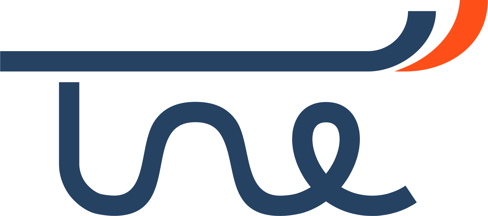

# 

[](https://tune.readthedocs.org)
[](https://pypi.python.org/pypi/tune/)[](https://pypi.python.org/pypi/tune/)
[](https://pypi.python.org/pypi/tune/)
[](https://codecov.io/gh/fugue-project/tune)

[](https://join.slack.com/t/fugue-project/shared_invite/zt-jl0pcahu-KdlSOgi~fP50TZWmNxdWYQ)

Tune is an abstraction layer for general parameter tuning. It is built on [Fugue](https://github.com/fugue-project/fugue) so it can seamlessly run on any backend supported by Fugue, such as Spark, Dask and local.

## Installation

```bash
pip install tune
```

It's recommended to also install Scikit-Learn (for all compatible models tuning) and Hyperopt (to enable [Bayesian Optimization](https://en.wikipedia.org/wiki/Bayesian_optimization))

```bash
pip install tune[hyperopt,sklearn]
```

## Quick Start

To quickly start, please go through these tutorials on Kaggle:

1. [Search Space](https://www.kaggle.com/goodwanghan/tune-tutorials-01-seach-space)
2. [Non-iterative Problems](https://www.kaggle.com/goodwanghan/tune-tutorials-2-non-iterative-problems), such as Scikit-Learn model tuning
3. [Iterative Problems](https://www.kaggle.com/goodwanghan/tune-tutorials-3-iterative-problems), such as Keras model tuning


## Design Philosophy

Tune does not follow Scikit-Learn's model selection APIs and does not provide distributed backend for it. **We believe that parameter tuning is a general problem that is not only for machine learning**, so our abstractions are built from ground up, the lower level APIs do not assume the objective is a machine learning model, while the higher level APIs are dedicated to solve specific problems, such as Scikit-Learn compatible model tuning and Keras model tuning.

Although we didn't base our solution on any of [HyperOpt](http://hyperopt.github.io/hyperopt/), [Optuna](https://optuna.org/), [Ray Tune](https://docs.ray.io/en/master/tune/index.html) and [Nevergrad](https://github.com/facebookresearch/nevergrad) etc., we are truly inspired by these wonderful solutions and their design. We also integrated with many of them for deeper level optimizations.

Tuning problems are never easy, here are our goals:

* Provide the simplest and most intuitive APIs for major tuning cases. We always start from real tuning cases, figure out the minimal requirement for each of them and then determine the layers of abstraction. Read [this tutorial](https://www.kaggle.com/goodwanghan/tune-tutorials-2-non-iterative-problems), you can see how minimal the interfaces can be.
* Be scale agnostic and platform agnostic. We want you to worry less about *distributed computing*, and just focus on the tuning logic itself. Built on Fugue, Tune let you develop your tuning process iteratively. You can test with small spaces on local machine, and then switch to larger spaces and run distributedly with no code change. It can effectively save time and cost and make the process fun and rewarding. And to run any tuning logic distributedly, you only need a core framework itself (Spark, Dask, etc.) and you do not need a database, a queue service or even an embeded cluster.
* Be highly extendable and flexible on lower level. For example
    * you can extend on Fugue level, for example create an execution engine for [Prefect](https://www.prefect.io/) to run the tuning jobs as a Prefect workflow
    * you can integrate third party optimizers and use Tune just as a distributed orchestrator. We have integrated [HyperOpt](http://hyperopt.github.io/hyperopt/). And [Optuna](https://optuna.org/) and [Nevergrad](https://github.com/facebookresearch/nevergrad) is on the way.
    * you can start external instances (e.g. EC2 instances) for different training subtasks and to fully utilize your cloud
    * you can combine with distributed training as long as your have enough compute resource

## Focuses

Here are our current focuses:

* A flexible space design and can describe a hybrid space of grid search, random search and second level optimization such as bayesian optimization
* Integrate with 3rd party tuning frameworks
* Create generalized and distributed versions of [Successive Halving](https://scikit-learn.org/stable/auto_examples/model_selection/plot_successive_halving_iterations.html), [Hyperband](https://arxiv.org/abs/1603.06560) and [Asynchronous Successive Halving](https://arxiv.org/abs/1810.05934).


## Collaboration

We are looking for collaborators, if you are interested, please let us know. Please join our [Slack channel](https://join.slack.com/t/fugue-project/shared_invite/zt-jl0pcahu-KdlSOgi~fP50TZWmNxdWYQ).
